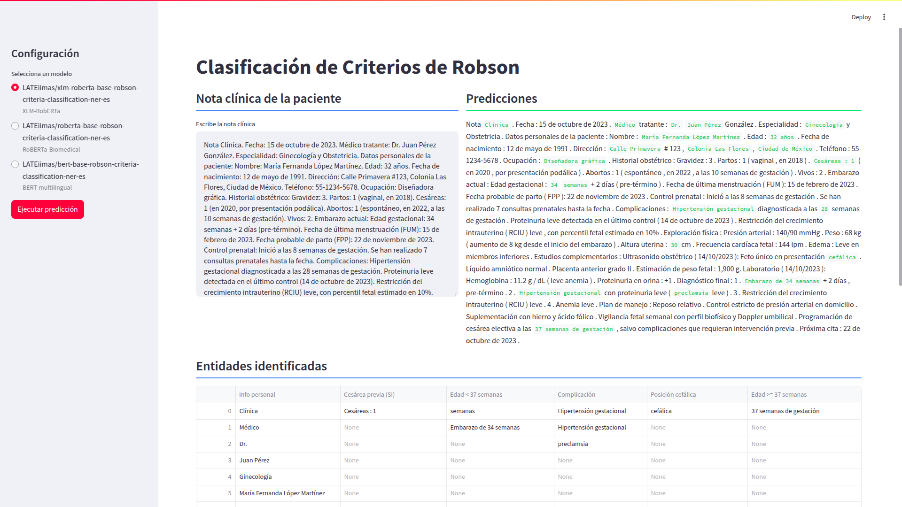

# web-app-robson-criteria-classification
Prototipo de aplicación web para identificar y extraer entidades clínicas relacionadas a la Clasificación de los Criterios de Robson (variables obstétricas) entre otras. La aplicación utiliza alguno de los modelos entrenadors (NER), además de clasificar la nota clínica en alguno de los 10 grupos de Robson.

## Interfaz del prototipo

